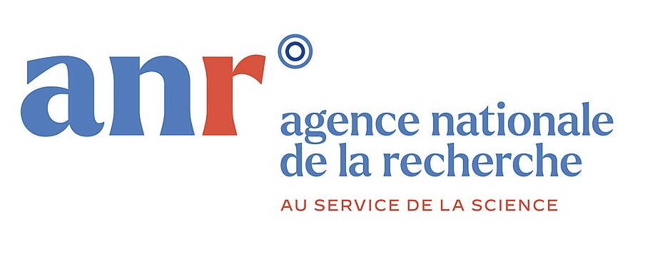

# e-NDP Vue

[](https://github.com/chartes/endp-vue/actions/workflows/node.js.yml)

[](https://vuejs.org/)


## Project setup

**Note : NodeJS 21.1.0 (using nvm to manage your NodeJs version)**

```
npm install --legacy-peer-deps
```

### Compiles and hot-reloads for development

```
npm run serve
```

### Run linter (Opt.)
```
npm run lint
```

### Run tests (Opt.)
```
npm run test::unit
```

## Deployment

1. Go to `vue.config.js` and check the line :

- in dev
```js
  publicPath: process.env.NODE_ENV === 'production' ? "/endp" : "/"
```

- in production
```js
  publicPath: process.env.NODE_ENV === 'production' ? "/" : "/"
```

2. Go to `.env.production.local` (create it if it doesn't exist - check template `.env.development` or `.env.production`) and check the lines

3. Build the project using the following command :

```bash
npm run build
```

4. Send the `dist/` folder to the server using `scp`

-------------------

e-NDP Vue is developed at the Mission projets numériques, École nationale des chartes - PSL.




Ce travail a bénéficié d’une aide de l’État gérée par l’Agence Nationale de la Recherche portant la référence [ANR-20-CE27-0012](https://anr.fr/Projet-ANR-20-CE27-0012) dans le cadre du projet "Notre-Dame de Paris et son cloître: les lieux, les gens, la vie – E-NDP".